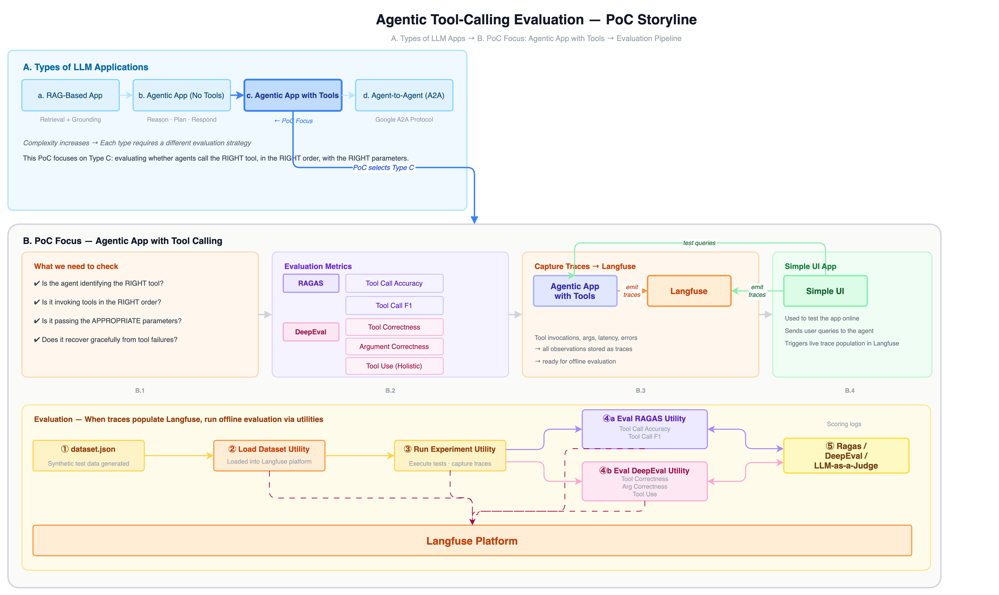
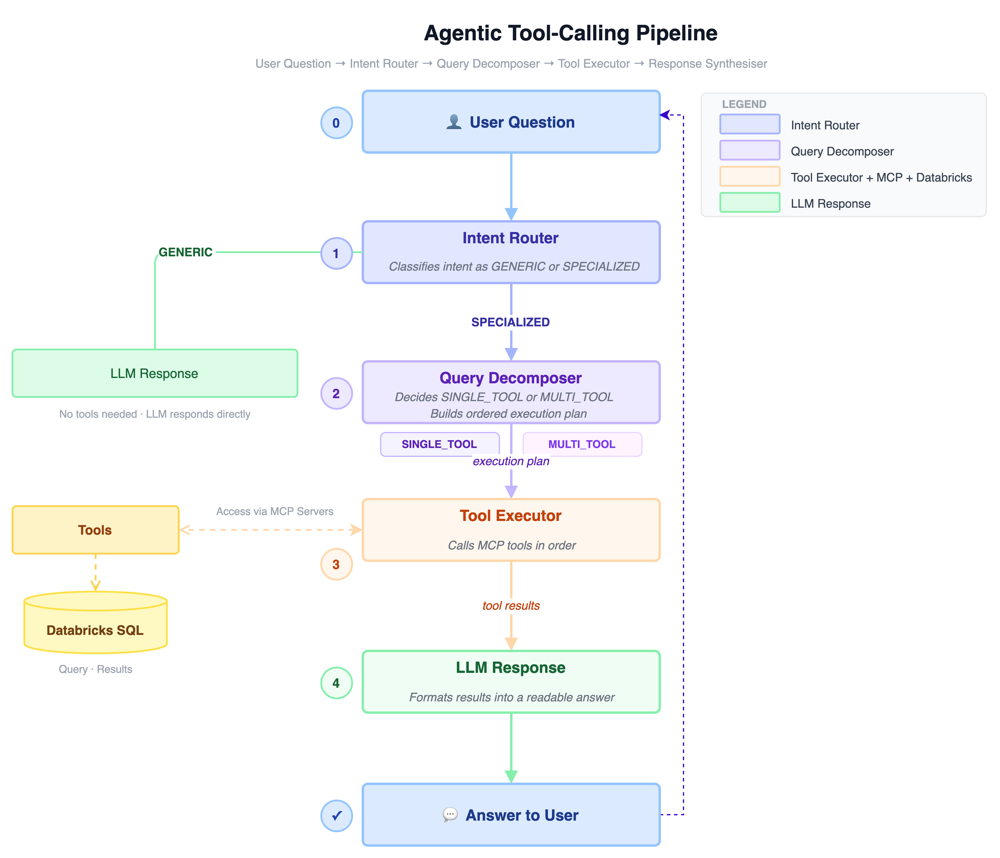

# AgentTool Eval App — Reference Implementation

A reference implementation for AI developers building agents with tool-calling capabilities.

Demonstrates a "AI Agent" built with **LangGraph**, **MCP (FastMCP)**, and a complete tool-call evaluation pipeline using **Langfuse**, **RAGAS**, and **DeepEval**.

---

## Where Does This Fit?

There are primarily four types of LLM apps being built today:

| # | Pattern | Description |
| --- | --- | --- |
| A | **RAG-based app** | LLM retrieves relevant documents from a vector store and generates an answer grounded in them |
| B | **Agentic app without tools** | LLM reasons, plans, and responds — but does not call any external system |
| C | **Agentic app with tool calling** | LLM selects and invokes tools (APIs, databases, functions) to fulfil a user's intent |
| D | **Agent-to-Agent (A2A)** | Multiple agents communicate with each other, e.g. via Google's A2A protocol |

**This app focuses on pattern C — agentic app with tool calling.**

Each pattern has different failure modes and needs different evaluation approaches. This app is scoped specifically to tool-calling agents, and that scope is intentional.

---

## The Problem This App Addresses

When an agent calls tools, three things can go wrong:

1. **Wrong tool selected** — the agent picks the wrong data source for the user's question
2. **Wrong order** — for multi-step queries, tools are invoked in the wrong sequence
3. **Wrong parameters** — the agent generates incorrect SQL or passes bad arguments

These failures are hard to catch without a structured evaluation approach. The question is: *how do you measure whether your agent is getting these right?*

---

## The Tech Stack
A modern, modular approach using industry-standard tools:
* **Orchestration:** LangGraph (Multi-step agent flows).
* **Tool Management:** MCP (FastMCP) using YAML-based definitions.
* **Observability:** Langfuse Python SDK v2 (Manual instrumentation for deep tracing).
* **Evaluation Frameworks:** RAGAS & DeepEval.
* **User Interface:** Streamlit.

## The 3-Step Evaluation Strategy

### Step 1 — Identify the right metrics

After evaluating what RAGAS and DeepEval offer for tool-calling, five metrics were selected across two frameworks:

| Framework | Metric | What It Measures |
| --- | --- | --- |
| **RAGAS** | `ToolCallAccuracy` | Did the agent call the right tools in the right order? (deterministic) |
| **RAGAS** | `ToolCallF1` | F1 score on tool names — partial credit for getting some tools right (deterministic) |
| **DeepEval** | `ToolCorrectness` | Were the correct tools selected for the user's intent? (LLM-judged) |
| **DeepEval** | `ArgumentCorrectness` | Were the arguments (SQL) relevant and correct for the question? (LLM-judged) |
| **DeepEval** | `ToolUse` | Did the agent stay within its authorised tool catalogue? (LLM-judged) |


### Step 2 — Capture the right traces

For these metrics to work, the agent needs to emit structured observations during runtime. Every tool call, every intent decision, every SQL argument needs to be captured.

The agent is instrumented using the **Langfuse Python SDK v2** with manual instrumentation — not a LangChain callback handler or OpenAI SDK. This gives full control over what gets traced and how it appears in Langfuse. Every node in the LangGraph graph emits spans and generations forwarded to Langfuse.

### Step 3 — Evaluate offline

Once traces are in Langfuse, evaluation runs offline against those traces. The runtime and the evaluation pipeline are deliberately separated — you can re-score existing traces without re-running the agent.

---

## Architecture



---

### Agent Flow



---

## Project Structure

```text
tools-call-sample-app/
├── pyproject.toml
├── .env.example
├── setup.sh / setup.bat
├── README.md
│
├── agent_eval/
│   ├── config.py                   # Central configuration (Pydantic settings)
│   ├── llm/
│   │   ├── factory.py              # LLM provider factory (NESGEN / OpenAI)
│   │   ├── nestle_chat_model_v2.py # LangChain BaseChatModel for NESGEN API
│   │   └── openai_chat_model.py    # LangChain BaseChatModel for OpenAI
│   ├── tools/
│   │   ├── handlers.py             # Databricks SQL query handler
│   │   └── db.py                   # Databricks connection + query execution
│   ├── mcp_server/
│   │   ├── server.py               # FastMCP server (tools loaded from YAML)
│   │   └── tools_config.yaml       # Tool definitions (name, description, schema)
│   ├── agent/
│   │   ├── graph_v2.py             # LangGraph agent (intent routing + tool execution)
│   │   ├── helpers.py              # Response extraction utilities
│   │   └── prompts.py              # System prompt
│   ├── observability/
│   │   └── tracer.py               # Langfuse SDK v2 tracing utilities
│   └── ui/
│       └── app.py                  # Streamlit chat interface
│
└── evaluation/
    ├── dataset.json                # 42 test cases
    ├── load_dataset.py             # Upload dataset to Langfuse
    ├── run_experiment.py           # Run agent on dataset; capture traces
    ├── eval_ragas.py               # Score traces with RAGAS
    ├── eval_deepeval.py            # Score traces with DeepEval
    └── utils.py                    # Retry / helper utilities
```

---

## Prerequisites

- **Python 3.11+**
- **[UV](https://docs.astral.sh/uv/)** package manager
- Nestle LLM API credentials (`NESTLE_CLIENT_ID`, `NESTLE_CLIENT_SECRET`)
- Databricks credentials (`DATABRICKS_HOST`, `DATABRICKS_AUTH_TYPE=azure-client-secret`, `ARM_CLIENT_ID`, `ARM_CLIENT_SECRET`, `ARM_TENANT_ID`, `WAREHOUSE_ID`, optional `DATABRICKS_CATALOG`, optional `DATABRICKS_SCHEMA`)
- *(Optional)* Langfuse credentials for observability

---

## Setup

### Quick setup (recommended)

**macOS / Linux:**

```bash
cd tools-call-sample-app
chmod +x setup.sh
./setup.sh
```

**Windows:**

```cmd
cd tools-call-sample-app
setup.bat
```

The setup script will:

1. Verify Python 3.11+ is installed
2. Install [UV](https://docs.astral.sh/uv/) if not present
3. Create `.env` from the template (edit with your credentials)
4. Install all dependencies via `uv sync`

### Manual setup

```bash
cd tools-call-sample-app

# Copy environment template and fill in your credentials
cp .env.example .env
# → Edit .env with your NESTLE_CLIENT_ID, NESTLE_CLIENT_SECRET,
#   DATABRICKS_HOST, DATABRICKS_AUTH_TYPE=azure-client-secret,
#   ARM_CLIENT_ID, ARM_CLIENT_SECRET, ARM_TENANT_ID, WAREHOUSE_ID,
#   DATABRICKS_CATALOG (optional, defaults to samples), DATABRICKS_SCHEMA (optional, defaults to bakehouse)

# Install dependencies with UV
uv sync
```

Databricks auth follows `WorkspaceClient()` unified authentication with `DATABRICKS_AUTH_TYPE=azure-client-secret`.
PAT auth (`DATABRICKS_TOKEN`) is intentionally disabled in this reference app.
Use `ARM_*` variables as the standard names.

By default, queries run against catalog `samples` and schema `bakehouse`. Set `DATABRICKS_CATALOG` and `DATABRICKS_SCHEMA` in `.env` to target a different Databricks catalog/schema without changing code.

---

## Running

### 1. Start the MCP Server

```bash
uv run python -m agent_eval.mcp_server.server
```

You should see:

```text
Starting MCP server on 0.0.0.0:8052
```

### 2. Launch the Chat App (separate terminal)

```bash
uv run streamlit run agent_eval/ui/app.py
```

Open `http://localhost:8501` in your browser.

The Streamlit UI is the **online testing surface** — it shows the agent's reasoning (intent classification, complexity decision, which tools were selected, execution times) in a collapsible panel next to each response. It is not the evaluation pipeline.

### 3. Run the Evaluation Pipeline

```bash
# Step 1 — upload dataset to Langfuse (one-time)
uv run python -m evaluation.load_dataset --dataset-name "tool-call-eval"

# Step 2 — run agent on dataset items; capture traces
uv run python -m evaluation.run_experiment \
  --dataset-name "tool-call-eval" \
  --experiment-name "exp-001"

# Step 3 — score the captured traces
uv run python -m evaluation.eval_ragas    --tag "exp-001"
uv run python -m evaluation.eval_deepeval --tag "exp-001"
```

See `evaluation/README.md` for full CLI reference, metrics documentation, and CI/CD examples.

---

## The Evaluation Pipeline

This is the offline part. It runs against traces already captured in Langfuse.

```text
dataset.json
     ↓
load_dataset.py     →  Loads 42 synthetic test cases into Langfuse as a named dataset
     ↓
run_experiment.py   →  Runs the agent on each dataset item; creates tagged Langfuse traces
     ↓
eval_ragas.py       →  Fetches traces by tag; scores ToolCallAccuracy + ToolCallF1; writes scores back
     ↓
eval_deepeval.py    →  Fetches traces by tag; scores ToolCorrectness + ArgumentCorrectness + ToolUse; writes scores back
```

The experiment tag (e.g. `exp-001`) is the thread that connects all steps — applied to every trace at creation time and used to filter traces at scoring time.

### Synthetic Dataset  

| Category | Count | What It Tests |
| --- | --- | --- |
| `perfect_match` | 7 | Single tool, correct selection — the baseline |
| `real_world` | 7 | Realistic business queries (aggregations, joins, date ranges) |
| `argument_extraction` | 6 | SQL generation from natural language (LIKE, GROUP BY, BETWEEN) |
| `multi_tool` | 6 | Two or three tools in sequence |
| `no_tool_needed` | 4 | General questions — agent should NOT call any tool |
| `ambiguous` | 3 | Vague requests — agent should ask for clarification |
| `conversational` | 3 | Casual phrasing with embedded data requests |
| `edge_case` | 3 | Unusual inputs (direct SQL, minimal requests, text search) |
| `wrong_order` | 2 | Explicit ordering — tests whether the agent respects sequence |
| `partial_completion` | 1 | Three-tool request — tests whether the agent misses any tool |

---

## How Useful Is This for an AI Developer?

The LLM integration, MCP server, and LangGraph are standard building blocks — a developer building a tool-calling agent will figure those out regardless. The question is: **what does this app actually save?**

### What takes time without a reference like this

#### 1. How to structure Langfuse traces for tool-calling agents

The Langfuse docs show basic tracing. What they don't show is how to structure traces when you have intent routing, query decomposition, sequential tool execution, and synthesis all happening in one graph. This app shows exactly how to nest spans and generations so the Langfuse dashboard is readable and useful — not just a flat list of events. This approach can be customized and leveraged.

#### 2. How to embed ground truth in traces so evaluation is self-contained

A common mistake is to store expected outputs only in the dataset and look them up at scoring time. This app shows the pattern of embedding `expected_tool_calls` directly in trace metadata at creation time — so eval scripts can score any trace independently, without re-fetching the dataset. This matters when running evaluations in CI.

#### 3. The two-phase evaluation pattern

`run_experiment` captures the traces whereas `eval_ragas`/`eval_deepeval` evaluates the traces and produces the scores. This can be leveraged.

### What a developer would actually do with this

A developer building a tool-calling agent on a different domain would:

1. **Reuse** the evaluation pipeline (`load_dataset.py`, `run_experiment.py`, `eval_ragas.py`, `eval_deepeval.py`, `utils.py`) — these are domain-agnostic
2. **Customize & Reuse** the Langfuse tracing pattern from `tracer.py` and `graph_v2.py` — the span/generation structure is reusable
3. **Replace** `tools_config.yaml` with their own tool definitions
4. **Replace** `dataset.json` with test cases for their domain
5. **Enhance** `prompts.py` with their domain's system prompt
6. **Customize** `db.py` with their own data access layer (not Databricks-specific)

The agent architecture (intent router → decomposer → executor → synthesiser) is a reasonable starting point for most tool-calling agents, but teams will adapt it to their specific routing logic.

### Realistic expectation

This app saves a developer from having to figure out the tracing structure, the evaluation pipeline wiring, and the RAGAS/DeepEval integration from scratch. It accelerates the journey — it does not replace the use-case-specific work of writing good test cases, designing the right prompts, and connecting to actual data sources.

---

## Key Design Considerations

| Consideration | Rationale |
| --- | --- |
| **LangChain `BaseChatModel`** wrapper | Plugs into LangGraph natively with `bind_tools`; works for both NESGEN and OpenAI |
| **MCP (FastMCP)** for tools | Dynamic tool registration from YAML; no code changes needed to add/remove tools |
| **Databricks SQL tools** | Agent generates SQL; tools execute it — decouples query logic from data access |
| **Langfuse Python SDK v2** | Manual instrumentation gives full control over trace structure and metadata |
| **Two-phase evaluation** | `run_experiment` captures traces; `eval_ragas`/`eval_deepeval` score them separately |

---

## Strengths and Limitations

**What this app does well:**

- Shows the complete tool-calling evaluation stack in one place — agent, tracing, dataset, scoring
- The separation of execution and scoring is a useful pattern. It can be leveraged
- Using two frameworks (RAGAS + DeepEval) together gives both fast deterministic checks and LLM-judged argument quality
- The MCP + YAML tool definition pattern makes tool management clean

**What this app does not do:**

- Does not cover RAG evaluation (already covered in RAG-evaluation-cookbooks), multi-agent evaluation, or tool-free agent evaluation
- The synthetic dataset is Bakehouse-specific — teams need to generate their own test cases for their domain
- The Databricks connection requires credentials most teams won't have — the data access layer needs to be adapted
- It is a reference app, not a production-ready framework — hardening (error handling, auth, scaling) is still needed for production use

---

## Summary

> This app shows, in working code, how to build a tool-calling LLM agent, instrument it for observability, and evaluate whether it is selecting the right tools and generating correct arguments — using RAGAS and DeepEval against Langfuse-captured traces.
